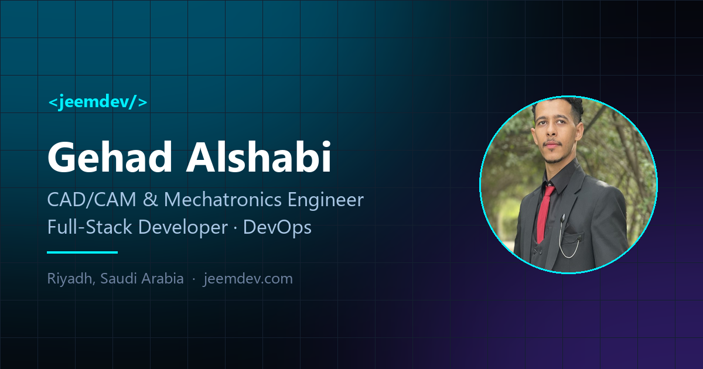

<div align="center">



# Personal portfolio &amp; CV

**[gehadalshabi.jeemdev.net](https://gehadalshabi.jeemdev.net)**

A bilingual (English / Arabic) portfolio site built with nothing but HTML, CSS and JavaScript.
No framework, no build step, no `node_modules`, no `package.json`.

</div>

---

## Why it is built this way

A portfolio is a developer's smallest complete product, so the constraint I set was that it
had to justify itself: if the site claims I can build things, the site itself should be the
first piece of evidence.

That ruled out a template, and it ruled out reaching for a framework to render what is, in
the end, one page of text. What is left is a small amount of plain code doing a few things
properly.

| | |
|---|---|
| **Runtime dependencies** | none — one stylesheet from Google Fonts, nothing else |
| **Build step** | none; `index.html` opens straight from disk |
| **Source** | ~2,300 lines across four files |
| **First load** | ~225 KB including the photo |
| **Hosting** | GitHub Pages, static, free |

---

## What it does

- **English and Arabic**, switched instantly with no page reload. The whole layout mirrors to
  right-to-left, the typeface changes, and the timeline, form labels and scroll indicator all
  flip with it.
- **Follows the device's light/dark setting**, with a manual override that is remembered. The
  theme is applied before first paint, so there is no flash of the wrong palette.
- **Documents are first-class.** Certificates, diplomas and the CV are attached to the thing
  they are evidence for — the ICDL certificate sits on the ICDL qualification, the graduation
  report sits on both the degree and the project it came from. They preview in-page rather
  than downloading.
- **Language-matched documents.** Where a file exists in both languages, a reader in English
  is offered the English one and a reader in Arabic the Arabic one.
- **Motion that stays out of the way** — a mouse-reactive particle field, scroll reveals,
  magnetic buttons, 3D card tilt. All of it disabled under `prefers-reduced-motion`.
- **Prints cleanly.** `Ctrl+P` produces a readable paper CV, not a screenshot of a dark theme.

---

## How it works

### One file holds the content

`index.html` is a shell of empty containers. Every word on the page comes from
[`data/content.js`](data/content.js) — a single object covering identity, skills, experience,
education, projects and documents. `assets/js/main.js` renders it into the DOM.

Editing the site means editing one object. Nothing else has to be touched to add a job, a
project or a certificate.

### Bilingual by data, not by duplication

There is no second copy of the site and no translation file to keep in sync. Any string is
either a plain value or a pair:

```js
title: "SolidWorks"                        // identical in both languages
title: { en: "Experience", ar: "الخبرات" }  // one per language
```

A `t()` helper resolves whichever applies, falling back to English when a translation is
missing. Half-translated content renders correctly rather than breaking, so a new field can
be added in English today and translated later.

Right-to-left is handled by flipping `dir` on the document and letting a block of
`:root[dir="rtl"]` rules mirror the handful of things that do not mirror automatically — the
timeline rail, the floating form labels, the gradient on section rules.

### Documents attach to what they evidence

Any education entry, job or project can carry a `files` array:

```js
files: [
  { label: { en: "Certificate", ar: "الشهادة" },
    file: "assets/certificates/hse-engineering.pdf", type: "pdf" },
]
```

One `fileChips()` helper renders these wherever they appear, so language filtering and the
PDF-versus-image choice behave identically across all three sections. A `lang` key on a file
restricts it to one language, which is how the two Project Management certificates resolve to
one chip.

Every referenced file is checked with a `HEAD` request on load; anything missing is flagged on
its own card rather than failing silently when somebody clicks it.

### Private documents never enter the repository

This repository is public, and a portfolio attracts exactly the kind of document that should
not be. Identity documents, anything carrying a date of birth or a national ID number, and
reference letters containing a referee's personal phone number all live under a directory that
`.gitignore` excludes:

```
assets/certificates/_private/
```

They stay on disk, usable when an employer asks for them directly, and have never been
committed. The published site is checked against this: those paths return 404.

---

## Running it locally

No install step.

```bash
git clone https://github.com/jeehadalshoapi/Gehad-alshabi.git
cd Gehad-alshabi
```

Open `index.html` directly, or serve it over HTTP so the missing-file checks and PDF previews
behave exactly as they do in production:

```bash
python -m http.server 8000
# http://localhost:8000
```

---

## Deploying

The site is static, so any host works. It currently runs on **GitHub Pages**: push to `main`
and it is live in about a minute. `CNAME` holds the custom domain; `netlify.toml` is kept for
the Netlify path, which sets caching and security headers that Pages ignores.

---

## Layout

```
index.html              markup shell — containers, no content
data/content.js         ← everything the page says
assets/
  css/style.css         design tokens, layout, motion, light & dark, RTL
  js/main.js            renders content.js, plus the motion layer
  docs/                 CV, English and Arabic
  certificates/         published certificates
    _private/           ignored — identity documents, referee letters
  projects/             project thumbnails
    _src/               ignored — original logo artwork
  img/                  photo, favicon, social card
CNAME robots.txt sitemap.xml netlify.toml
```

---

## Reusing this

The **code** — `index.html`, `assets/css/style.css`, `assets/js/main.js` and the shape of
`data/content.js` — is free to use as a starting point for your own site.

The **content** is not: the CV, certificates, photograph, project artwork and written text in
`data/content.js` are personal documents, and some of them are issued credentials. Replace all
of it with your own.

If you build on this, a link back is welcome but not required.

---

<div align="center">

**Gehad Fatehi Alshabi** — Mechatronics Engineer · Riyadh, Saudi Arabia

[Website](https://gehadalshabi.jeemdev.net) · [LinkedIn](https://linkedin.com/in/gehad-al-shabi) · [Google Play](https://play.google.com/store/apps/details?id=com.golazo.wc2026)

</div>
